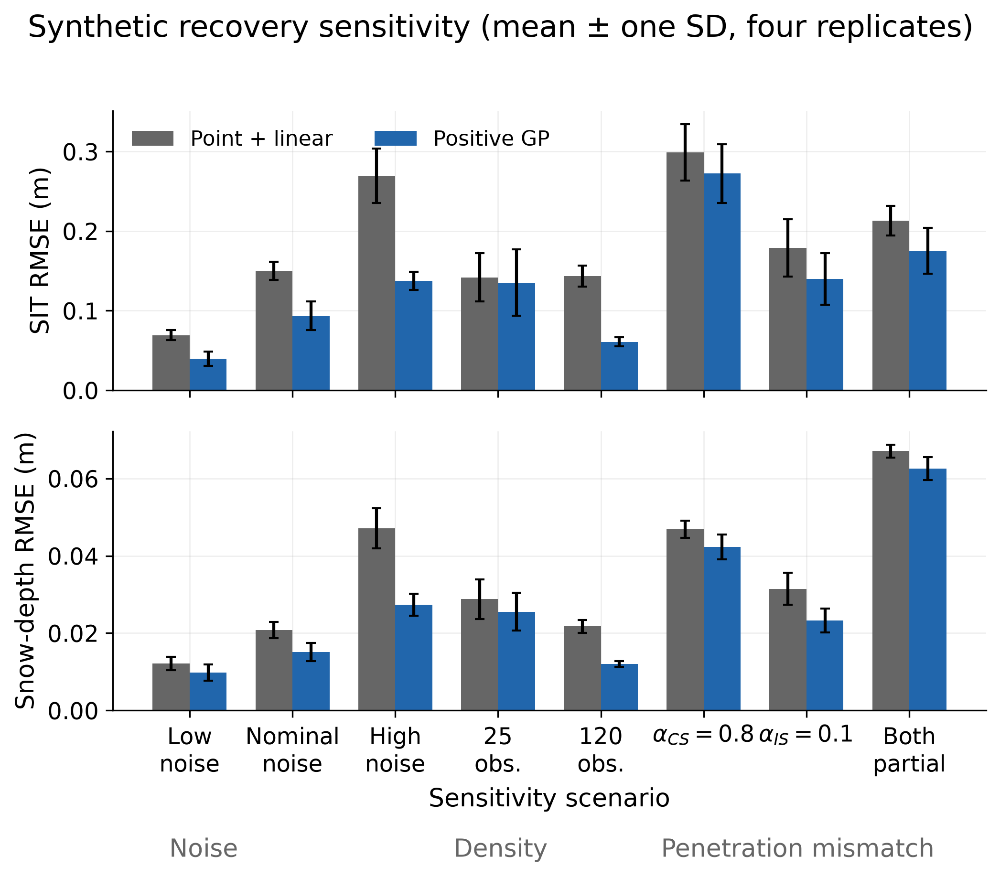
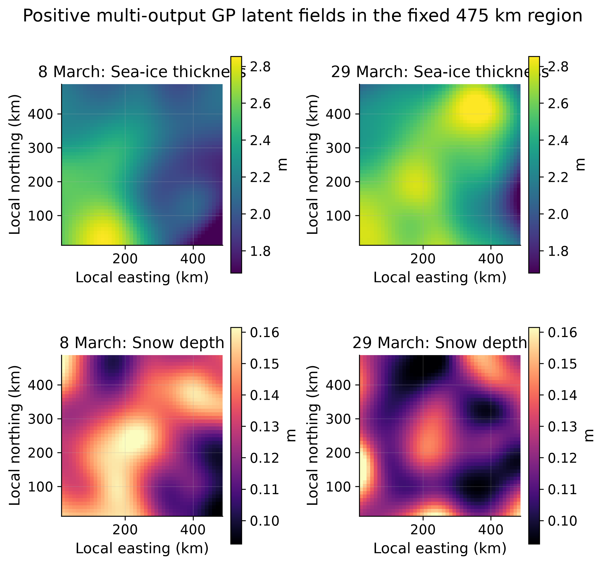

# Physically informed multi-output GP retrieval of Arctic sea ice

Code and reproducibility material for Jingwen Fan's MSc dissertation on the
joint retrieval of sea-ice thickness and snow depth from collocated CryoSat-2
and ICESat-2 freeboard observations.

The project tests a physically informed multi-output Gaussian-process (GP)
model in one and two spatial dimensions. It compares pointwise inversion,
linear and positive-latent GP variants, and a Deep Random Features (DRF)
adaptation. The experiments cover synthetic recovery, sensitivity to sensor
noise, radar/laser penetration and observation density, spatially blocked
validation, March-window robustness, an external-product consistency check,
and a fixed-region March 29 replication.

## Repository structure

```text
notebooks/              Executed analysis notebooks in dissertation order
scripts/                Reproducible experiment and figure-generation scripts
scripts/data_preparation/
                        Server-side extraction scripts for authorised users
data/                   Data-access notes; restricted observations are omitted
results/                Compact derived results used in the dissertation
figures/                Generated figures (created by the plotting script)
docs/                    Reproducibility and provenance notes
```

## Installation

Python 3.12 was used for the final runs. From the repository root:

```bash
python -m venv .venv
source .venv/bin/activate
python -m pip install --upgrade pip
python -m pip install -r requirements.txt
```

The DRF comparison uses the official
[DeepRandomFeatures](https://github.com/totony4real/DeepRandomFeatures)
PyTorch implementation. Install it as a separate editable dependency:

```bash
git clone https://github.com/totony4real/DeepRandomFeatures.git ../DeepRandomFeatures
python -m pip install -e ../DeepRandomFeatures
```

Alternatively, set `DRF_SRC` to the cloned repository's `src` directory before
running `scripts/run_drf_blocked_cv.py`. Third-party DRF source and its example
datasets are not copied into this repository.

## Reproducing the analysis

The synthetic experiment can be run without restricted data:

```bash
python scripts/run_synthetic_sensitivity.py
```

The real-data experiments require authorised CPOM inputs under
`data/processed/`; see [data/README.md](data/README.md). A complete experiment
order and expected outputs are given in
[docs/reproducibility.md](docs/reproducibility.md).

Figures used in the dissertation can be regenerated from the archived compact
results:

```bash
python scripts/make_result_figures.py
```

## Selected results

Synthetic recovery tests quantify sensitivity to noise, sampling density and
penetration assumptions:



The positive-latent model was then extended to a fixed two-dimensional region
and repeated on March 29:



These plots are generated from the archived result tables, not manually edited
images.

## Data and code provenance

The raw and processed CryoSat-2, ICESat-2 and validation-product data are not
redistributed here. Their access and use are subject to the original providers
and the CPOM project environment. See
[docs/data_provenance.md](docs/data_provenance.md).

The supervisor-provided `MultioutputGPPlayground.ipynb` served as a conceptual
starting point. It is not included and is not presented as student-authored
code. The notebooks in this repository are dissertation-specific adaptations
and experiments. See [docs/code_provenance.md](docs/code_provenance.md).

The DRF comparison should be cited as Chen, Mahmood, Tsamados and Takao,
*Deep Random Features for Scalable Interpolation of Spatiotemporal Data*
([arXiv:2412.11350](https://arxiv.org/abs/2412.11350)).

## Citation

If referring to this coursework repository, use the metadata in
[`CITATION.cff`](CITATION.cff). No software licence is granted by the absence
of a `LICENSE` file.
